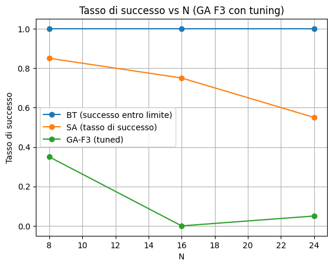
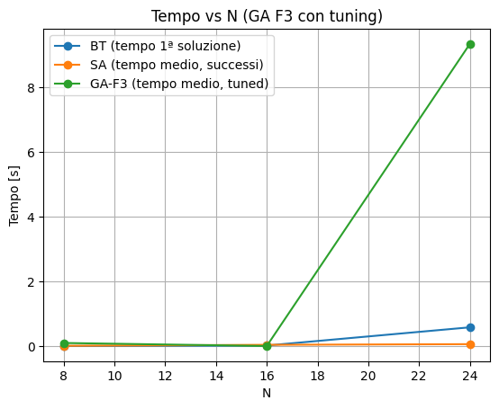

# 1. Introduzione

Il problema delle *N regine* (N-Queens) consiste nel posizionare N regine su una scacchiera N×N in modo che nessuna minacci le altre. In termini formali, nessuna coppia di regine deve condividere la stessa riga, colonna o diagonale.

Questo problema è un classico esempio di problema di soddisfacimento di vincoli e viene spesso utilizzato come benchmark per:

- algoritmi **esatti** (ricerca esaustiva e backtracking),
- algoritmi **metaeuristici** (simulated annealing, algoritmi genetici),
- studio dello **scaling** del costo computazionale al variare della dimensione N.

In questo lavoro vengono confrontati tre approcci:

1. **Backtracking (BT)** iterativo, senza ricorsione;
2. **Simulated Annealing (SA)**;
3. **Algoritmo Genetico (GA)** con diverse funzioni di fitness (F1…F6) e con una procedura di tuning automatico dei parametri.

Gli obiettivi principali sono:

- analizzare il **tasso di successo** dei diversi algoritmi al variare di N;
- confrontare il **costo computazionale** (numero di passi / generazioni e tempo di esecuzione);
- studiare l’effetto di diverse **funzioni di fitness** sul comportamento del GA;
- valutare l’impatto della **dimensione della popolazione** e del **numero massimo di generazioni**.

---

# 2. Formulazione del problema e rappresentazione

Il problema N-Queens richiede di posizionare N regine su una scacchiera N×N in modo che:

- non ce ne siano due sulla stessa riga;
- non ce ne siano due sulla stessa colonna;
- non ce ne siano due sulla stessa diagonale (principale o secondaria).

Nel progetto viene adottata la seguente rappresentazione:

- una configurazione è un vettore di interi:

  ```text
  board[col] = row
````

dove:

* `col` è l’indice di colonna (0…N-1),
* `row` è la riga della regina in quella colonna.

Con questa codifica è garantito che ci sia **al massimo una regina per colonna**, mentre possono esistere conflitti sulle righe e sulle diagonali.

Due regine sono in conflitto se:

* hanno la stessa riga: `row[i] == row[j]`;
* sono sulla stessa diagonale principale: `row[i] - i == row[j] - j`;
* sono sulla stessa diagonale secondaria: `row[i] + i == row[j] + j`.

La funzione chiave è:

```text
conflicts(board) → numero di coppie di regine in conflitto
```

Per efficienza è stata implementata in **O(N)**, usando contatori per:

* righe (`row_count[row]`),
* diagonali principali (`diag1[row - col]`),
* diagonali secondarie (`diag2[row + col]`),

e sommando, per ogni contatore `cnt > 1`, le combinazioni `cnt * (cnt - 1) / 2`.

---

# 3. Algoritmi considerati

## 3.1 Backtracking (BT) iterativo

L’algoritmo di backtracking esplora lo spazio delle configurazioni colonna per colonna, posizionando una regina alla volta e facendo backtrack quando non sono possibili posizionamenti validi.

Caratteristiche principali:

* implementazione **iterativa**, senza ricorsione, tramite:

  * vettore `pos[col]` per la riga scelta in ogni colonna,
  * array booleani:

    * `row_used[row]` (righe occupate),
    * `diag1_used[row - col + (N-1)]`,
    * `diag2_used[row + col]`;
* viene cercata **una sola soluzione** (la prima trovata);
* viene mantenuto un contatore dei **nodi esplorati**, cioè tentativi di posizionamento.

Per ogni N si misurano:

* `solution_found` (true/false),
* `nodes` (nodi esplorati),
* `time` (tempo per trovare la prima soluzione).

BT risulta:

* molto efficiente per N piccoli (pochi nodi e tempi ridotti),
* rapidamente più costoso al crescere di N (esplosione dello spazio di ricerca).

---

## 3.2 Simulated Annealing (SA)

Simulated Annealing (SA) è una metaeuristica ispirata ai processi di ricottura in metallurgia. Parte da una soluzione casuale e applica modifiche locali, accettando anche mosse peggiorative in funzione di una temperatura che decresce nel tempo.

Elementi principali dell’implementazione:

* **stato**: configurazione `board[col] = row` generata casualmente;
* **costo**: `conflicts(board)`, cioè il numero di coppie di regine in conflitto;
* **mossa**: scelta di una colonna casuale e variazione della riga della relativa regina;
* **accettazione**:

  * se il costo diminuisce (meno conflitti), la mossa è sempre accettata;
  * se il costo aumenta, la mossa viene accettata con probabilità `exp(-Δ / T)`, con:

    * `Δ` = aumento dei conflitti,
    * `T` = temperatura corrente;
* **raffreddamento**:

  * temperatura iniziale `T0`,
  * aggiornata con `T = alpha * T` ad ogni iterazione.

Parametri tipici nel codice:

* `max_iter = 2000 + 200 * N`,
* `T0 = 1.0`,
* `alpha = 0.995`.

Per ogni run SA restituisce:

* `success` (true se viene raggiunta una configurazione con 0 conflitti),
* `steps` (numero di iterazioni),
* `time` (tempo di esecuzione),
* `best_conflicts` (numero di conflitti del miglior stato trovato),
* `evals` (numero di valutazioni della funzione `conflicts`).

---

## 3.3 Algoritmo Genetico (GA)

L’algoritmo genetico (GA) mantiene una popolazione di individui (configurazioni) e applica iterativamente:

* selezione,
* crossover,
* mutazione.

### Rappresentazione

* individuo: lista di N interi `ind[col] = row`,
* popolazione iniziale: individui con righe casuali per ogni colonna.

### Operatori

* **Selezione**: torneo di dimensione 3
  (si estraggono 3 individui a caso e si seleziona il migliore secondo la fitness).

* **Crossover**: one-point (monofrontiera)
  si sceglie un indice di taglio `k` e si combina:

  ```text
  figlio1 = genitore1[0:k] + genitore2[k:]
  figlio2 = genitore2[0:k] + genitore1[k:]
  ```

* **Mutazione**: con probabilità `p_m`, per ogni figlio:

  * si sceglie una colonna casuale,
  * si assegna una nuova riga casuale alla regina in quella colonna.

### Parametri principali

* `pop_size`: dimensione della popolazione,
* `max_gen`: numero massimo di generazioni,
* `p_c`: probabilità di applicare il crossover (tipicamente 0.8),
* `p_m`: probabilità di mutazione (tra 0.05 e 0.15),
* `tournament_size`: dimensione del torneo (3).

### Criterio di arresto

Un singolo run del GA termina quando:

* viene trovato un individuo con 0 conflitti (`success = true`), oppure
* viene raggiunta la generazione `max_gen` senza soluzione (`success = false`).

Output di un run:

* `success` (true/false),
* `gen` (numero di generazioni effettivamente utilizzate),
* `time` (tempo di esecuzione in secondi),
* `best_conflicts` (conflitti residui del miglior individuo),
* `evals` (numero di valutazioni di fitness).

---

# 4. Funzioni di fitness per il GA (F1…F6)

Le funzioni di fitness definiscono come il GA valuta gli individui. L’obiettivo è assegnare valori più alti alle configurazioni “migliori” (meno conflitti, struttura desiderabile).

Di seguito le principali versioni implementate.

### F1 – fitness ingenua

```text
F1(ind) = -conflicts(ind)
```

* più conflitti ⇒ fitness più bassa;
* è la scelta più semplice, ma fornisce un segnale spesso troppo debole, soprattutto per N grandi.

### F2 – coppie non in conflitto

```text
max_pairs = N * (N - 1) / 2
F2(ind) = max_pairs - conflicts(ind)
```

Per un N fissato, `max_pairs` è una costante, quindi F2 è sostanzialmente F1 traslata.
Dal punto di vista dell’ordinamento degli individui:

* F1 e F2 producono esattamente lo stesso ranking,
* quindi hanno lo stesso effetto sulla selezione.

### F3 – penalità sui cluster diagonali (lineare)

F3 introduce una penalità sulle diagonali con più regine:

* per ogni diagonale principale (`r - c`) e secondaria (`r + c`) si conta il numero di regine `cnt`,
* se `cnt > 1`, si aggiunge una penalità `C(cnt, 2)`.

La fitness è:

```text
F3(ind) = max_pairs - penalty_diag
```

Questo scoraggia configurazioni con molte regine allineate sulle stesse diagonali.

### F4 – F2 meno la “regina peggiore”

F4 combina F2 con l’idea di “regina peggiore”:

```text
F4(ind) = F2(ind) - worst
```

dove `worst` è il massimo numero di conflitti di una singola regina.
Penalizza le configurazioni in cui una regina è particolarmente “incasinata”.

### F5 – penalità diagonali quadratica

Simile a F3, ma con penalità più aggressiva:

* se una diagonale contiene `cnt` regine, la penalità cresce come `cnt²` (o altra funzione quadratica).

La fitness è:

```text
F5(ind) = max_pairs - penalty_quad
```

Le diagonali molto affollate vengono penalizzate più severamente rispetto a F3.

### F6 – trasformazione esponenziale

F6 applica una trasformazione esponenziale al numero di conflitti:

```text
F6(ind) = exp(-λ * conflicts(ind))
```

con `λ > 0` (tipicamente 0.3).
Questo rende molto più marcata la differenza tra:

* soluzioni con pochi conflitti (fitness molto più alta),
* soluzioni molto cattive (fitness prossime a 0).

---

# 5. Metriche di valutazione

Per confrontare SA e GA vengono eseguiti, per ogni combinazione (N, fitness, parametri):

* **BT**: una singola esecuzione (deterministica);
* **SA**: più run indipendenti, ad esempio 20;
* **GA**: più run indipendenti, ad esempio 20.

Le metriche principali sono:

* **Tasso di successo (`success_rate`)**

  ```text
  success_rate = (# run con success = true) / (# run totali)
  ```

* **Generazioni medie sui run riusciti (`avg_gen_success`, solo GA)**

  ```text
  avg_gen_success = media dei valori di gen sui run con success = true
  ```

  Risponde alla domanda:
  *“Quando il GA trova una soluzione, in media quante generazioni servono?”*

* **Tempo medio sui run riusciti (`avg_time_success`)**

  Tempo medio in secondi sui soli run che terminano con successo.

Queste metriche permettono di analizzare:

* **affidabilità** (success_rate),
* **efficienza** (avg_gen_success, avg_time_success).

---

# 6. Tuning dei parametri GA

I parametri del GA (dimensione della popolazione, numero massimo di generazioni, probabilità di mutazione) influenzano fortemente il tasso di successo e il tempo di esecuzione. Per questo è stata implementata una procedura di tuning automatico.

## 6.1 Griglia di ricerca

Per ogni coppia (N, fitness Fₖ) si esplora una griglia di parametri, ad esempio:

* `pop_size ∈ {max(50, 3N), max(50, 6N), max(50, 10N)}`
* `max_gen ∈ {20N, 40N, 60N}`
* `p_m ∈ {0.05, 0.10, 0.15}`
* `p_c = 0.8`
* `tournament_size = 3`

Per ogni combinazione `(pop_size, max_gen, p_m)` vengono eseguiti `RUNS_GA_TUNING` run (ad esempio 5–10), e si calcolano:

* `success_rate`,
* `avg_gen_success`.

I risultati del tuning vengono salvati in file CSV (es. `tuning_GA_F1.csv`, `tuning_GA_F3.csv`, …).

## 6.2 Criterio di scelta dei parametri ottimali

La scelta dei parametri ottimali segue il criterio:

1. **Massimizzare il tasso di successo (`success_rate`)**.
2. A parità di `success_rate`, **minimizzare `avg_gen_success`**.

In questo modo si privilegiano:

* combinazioni che rendono il GA affidabile (alta probabilità di trovare la soluzione),
* e, tra queste, quelle più efficienti in termini di generazioni necessarie.

## 6.3 Osservazioni

* Parametri troppo **piccoli** (popolazione ridotta, poche generazioni) rendono il GA veloce ma con `success_rate` spesso inaccettabile, soprattutto con fitness deboli (F1/F2).
* Parametri più **generosi** (popolazioni grandi e `max_gen` elevato) aumentano il tasso di successo, ma al prezzo di tempi più lunghi: è un trade-off naturale negli algoritmi genetici.

---

# 7. Risultati sperimentali (qualitativi)

> Nota: qui puoi inserire le tue **tabelle reali** e i tuoi **grafici**.

Esempio di tabella tipo (da riempire con i dati reali):

```markdown
**Esempio – Confronto BT / SA / GA-F3 (parametri tuning)**

| N  | BT succ. | BT nodi  | BT s   | SA succ. | SA iter medie | SA s    | GA-F3 succ. | GA gen medie | GA s    |
|----|----------|----------|--------|----------|---------------|---------|-------------|--------------|---------|
|  8 | 1.00     | ...      | ...    | 1.00     | ...           | ...     | ...         | ...          | ...     |
| 16 | 1.00     | ...      | ...    | ...      | ...           | ...     | ...         | ...          | ...     |
| 24 | 1.00     | ...      | ...    | ...      | ...           | ...     | ...         | ...          | ...     |
| 32 | 1.00     | ...      | ...    | ...      | ...           | ...     | ...         | ...          | ...     |
```

E grafici tipo:

```markdown



```

## 7.1 Comportamento di F1 e F2

Nei test con F1 e F2, anche dopo il tuning, si osserva che:

* per N piccoli (N = 8) il tasso di successo può rimanere intorno al 50–60%;
* per N medi (N = 16, 24) il tasso di successo scende ulteriormente;
* l’aumento di `pop_size` e `max_gen` migliora solo parzialmente la situazione, a fronte di tempi crescenti.

Poiché F2 è sostanzialmente F1 traslata, le due funzioni producono prestazioni molto simili. Questo indica che:

> una fitness basata solo sul numero totale di conflitti fornisce un segnale troppo debole per guidare efficacemente l’evoluzione, soprattutto al crescere di N.

F1 e F2 vengono quindi utilizzate principalmente come **baseline** per mostrare i limiti di una fitness ingenua.

## 7.2 Comportamento di F3, F5 e F6

Con F3, che penalizza esplicitamente i cluster di regine sulle stesse diagonali, il comportamento del GA migliora in modo significativo, a parità (o con moderato aumento) del budget computazionale:

* per N piccoli il tasso di successo può avvicinarsi al 100%;
* per N medi e grandi il GA mantiene `success_rate` nettamente superiore rispetto a F1/F2.

F5 (penalità quadratica) e F6 (trasformazione esponenziale) mostrano un comportamento analogo, con differenze di dettaglio nei tempi di convergenza e nella sensibilità ai parametri.

Nel complesso:

* F3/F5/F6 risultano **molto più efficaci** di F1/F2;
* il costo computazionale aumenta, ma con un guadagno sostanziale in termini di probabilità di successo.

## 7.3 Confronto complessivo BT – SA – GA

Sintesi qualitativa:

* **BT**

  * per N piccoli trova soluzioni rapidamente e in modo deterministico;
  * al crescere di N il numero di nodi esplorati e il tempo di esecuzione aumentano rapidamente;
  * rimane la scelta ideale quando N è contenuto e si vuole una soluzione certa.

* **SA**

  * offre un buon compromesso tra semplicità, costo e tasso di successo;
  * richiede un tuning moderato dei parametri (temperatura iniziale, schema di raffreddamento, numero massimo di iterazioni);
  * per N medi può essere competitivo sia in termini di tempo che affidabilità.

* **GA con fitness F3 (e varianti)**

  * se dotato di parametri tuning adeguati (popolazione e generazioni sufficienti), può ottenere i tassi di successo più elevati, soprattutto per N medi/grandi;
  * è il metodo più costoso in termini di `pop_size × max_gen`, ma anche il più flessibile e robusto;
  * è particolarmente adatto quando si può accettare un costo computazionale maggiore in cambio di un’elevata probabilità di successo.

---

# 8. Ottimizzazioni di performance

Per rendere gli esperimenti praticabili, soprattutto durante il tuning del GA, sono state introdotte alcune ottimizzazioni.

## 8.1 Funzione `conflicts` in O(N)

La versione ingenua di `conflicts` ha complessità O(N²) (doppio ciclo su tutte le coppie di colonne). È stata sostituita da una versione O(N) basata su:

* conteggio delle righe,
* conteggio delle diagonali principali `r - c`,
* conteggio delle diagonali secondarie `r + c`.

Per ciascun contatore `cnt > 1` si aggiunge `cnt * (cnt - 1) / 2` al numero di conflitti.

Questa modifica riduce drasticamente il costo di ogni valutazione della fitness, che è la parte più chiamata sia in SA che in GA.

## 8.2 Tuning “controllato”

Per evitare tempi eccessivi:

* per N piccoli si può usare una griglia di parametri più ricca;
* per N grandi si riduce la griglia (meno valori di `pop_size`, `max_gen`, `p_m`) e/o il numero di run per combinazione;
* è possibile introdurre un **early-stop**: se una combinazione raggiunge `success_rate = 1.0` con poche generazioni, non ha senso provare combinazioni peggiori.

## 8.3 Esecuzione parallela (multiprocessing)

Poiché i run di SA e GA sono indipendenti, è possibile sfruttare i core multipli della CPU utilizzando, ad esempio, `ProcessPoolExecutor`:

* ogni run viene eseguito in un processo separato;
* il tempo totale per completare il tuning si riduce quasi linearmente con il numero di core.

## 8.4 Compilazione JIT (Numba, opzionale)

Per ulteriori miglioramenti, le parti numeriche più critiche (come `conflicts`) possono essere annotate con Numba (`@njit`) e compilate Just-in-Time, ottenendo speed-up significativi. Questo è particolarmente utile quando si sperimentano valori di N più grandi.

---

# 9. Conclusioni

In questo lavoro sono stati confrontati tre algoritmi per la risoluzione del problema N-Queens:

* backtracking iterativo (BT),
* simulated annealing (SA),
* algoritmo genetico (GA) con diverse funzioni di fitness e tuning dei parametri.

I risultati qualitativi mostrano che:

* **BT** è estremamente efficace per N piccoli, ma scala male al crescere della dimensione;
* **SA** rappresenta un buon compromesso tra costo e tasso di successo, con una complessità implementativa contenuta;
* **GA**, se dotato di una **funzione di fitness adeguata** (in particolare F3/F5/F6) e di parametri opportunamente calibrati (popolazioni più ampie e maggior numero di generazioni), può raggiungere tassi di successo molto elevati anche per N medi/grandi, al costo di tempi di esecuzione più lunghi.

Le funzioni F1 e F2, basate esclusivamente sul numero totale di conflitti, si sono rivelate insufficienti: anche aumentando popolazione e generazioni, il tasso di successo rimane basso. Ciò evidenzia l’importanza di progettare una **fitness informativa** e coerente con la struttura del problema.

Come possibili sviluppi futuri si possono considerare:

* l’integrazione di metodi ibridi (ad esempio GA + SA),
* l’uso sistematico di compilazione JIT per supportare dimensioni N più grandi,
* la definizione di altre funzioni di fitness specifiche per N-Queens,
* l’esplorazione di operatori di crossover e mutazione più sofisticati.
